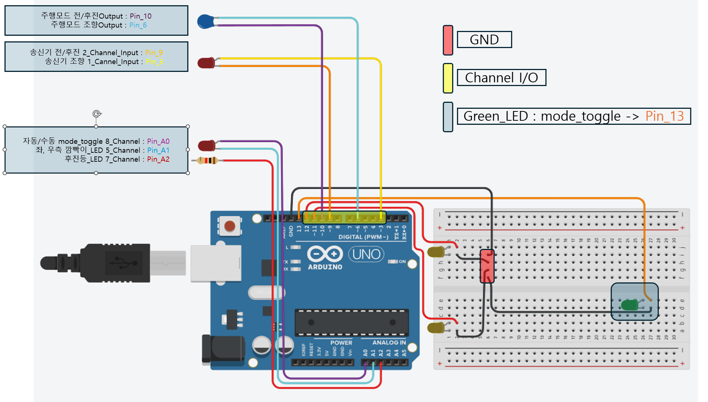

# RC_Auto_Mobility
---
**팀원 : 한주형, 강현**

**역할 분배**
- 한주형 : 아두이노 라즈베리파이 시리얼 통신 및 송수신기 통신 제어. 아두이노를 통한 수동&자동 속도제어 및 자율 주행 로직 제어 및 라인 트레이싱 제 담당.(기여도 100%)
- 강현 : 웹 소켓과 웹 브라우저 연동을 통한 라인 디텍싱 및 트레이싱 로직 제어. 실시간 웹 브라우징을 통한 수동 제어 가능 로직 담당. (기여도 100%)

---

## Youtube Link

---
# 🚗 RC Car 자율주행 시스템

본 프로젝트는 Raspberry Pi + Picamera2 + OpenCV + Arduino를 기반으로 한  
**라인 트레이싱 기반 자율주행 RC카 시스템**입니다.

- 라인트레이싱 기반 자율주행 + 수동모드 제어 전환
- 실시간 영상 스트리밍(WebSocket)
- 아두이노로 시리얼 명령 전송
- 방향 지시등 LED 상태 제어 및 깜빡이 기능

---

## 📂 프로젝트 구성

| 파일명 | 설명 |
|--------|------|
| `main.cpp` | RC카 하드웨어(PWM, 서보, ESC, LED 제어) |
| `Websockets_Connect_With_Arduino.py` | Raspberry Pi에서 영상 처리 및 시리얼 송신 |

---
## 📁 프로젝트 디렉토리 구조

```
Auto_Monility_With_RaspberryPi/
├── .pio/                    
├── .vscode/                
├── include/                 
├── lib/                     
├── src/
│   └── main.cpp             # 아두이노 메인 소스코드
├── test/                   
├── .gitignore               
├── platformio.ini           
└── README.md                
```

- **자율 주행 로직과 웹 소켓 로직이 들어있는 Websockets_Connect_With_Arduino.py와 index.html은 별도의 디렉토리 구조 형식입니다.**

---
## 🔌 아두이노 회로 연결 구성도

아래 회로는 **자동/수동 모드 전환**, **방향 지시등 LED**, **서보 및 ESC 제어**, **RC 수신기 채널 입력** 핀 구성을 시각화한 도식입니다.



---

### 📍 핀 구성 요약

| 기능 | 핀 번호 | 설명 |
|------|---------|------|
| 전진/후진 PWM 출력 (ESC) | `Pin 10` | 서보 또는 ESC 제어용 |
| 조향 서보 PWM 출력     | `Pin 6`  | 조향 서보 제어 |
| RC 수신기 전진/후진 입력 (CH2) | `Pin 9`  | RC 수신기의 CH2 연결 |
| RC 수신기 조향 입력 (CH1) | `Pin 3`  | RC 수신기의 CH1 연결 |
| 자동/수동 모드 전환 스위치 | `A0`     | CH8 → PWM 읽기 기반 |
| 방향 지시등 (우측, CH5) | `A1`     | CH5 값에 따라 LED1 점멸 |
| 방향 지시등 (좌측, CH7) | `A2`     | CH7 값에 따라 LED2 점멸 |
| 모드 표시 LED (녹색 LED) | `Pin 13` | 자동 모드일 때 ON |

---
## 🎮 RC 송수신기 & 아두이노 핀 매핑 구조


이 프로젝트는 **Radiolink AT9 송신기 + 수신기 + Arduino UNO** 기반으로 구성되어 있으며, 각 채널과 핀의 매핑은 다음과 같습니다.

---

### 🧭 1. 수신기(Receiver) → 아두이노 연결

- **CH1 (조향)**  
  - Signal → Arduino `Pin 3`  
  - 아두이노 PWM 입력 처리 후 → 조향 서보 제어 (`Pin 6`)

- **CH2 (전진/후진)**  
  - Signal → Arduino `Pin 9`  
  - 아두이노 PWM 입력 처리 후 → ESC 제어 (`Pin 10`)

- **CH5 (우측 깜빡이)**  
  - Signal → Arduino `Pin A1`  
  - 조건 만족 시 LED1 점멸

- **CH7 (좌측 깜빡이)**  
  - Signal → Arduino `Pin A2`  
  - 조건 만족 시 LED2 점멸

- **CH8 (모드 전환 스위치)**  
  - Signal → Arduino `Pin A0`  
  - 1500µs 초과 시 → 자동 모드 LED (`Pin 13`) ON

📝 참고: 수신기의 VCC + GND 라인은 CH1과 CH2에만 공급 (나머지는 Signal만 연결됨)  
🟢 측면 GND 포트 사용 가능 (Breadboard용 GND 확장)

---

### 🎮 2. 송신기(Radiolink AT9) 채널 기능

- **CH1**: 조향 (우/좌 조이스틱 → 핸들 각도 조절)
- **CH2**: 전/후진 (상/하 조이스틱 → 모터 방향/속도)
- **CH5**: 우측 깜빡이 제어용 채널 (스위치)
- **CH7**: 좌측 깜빡이 제어용 채널 (스위치)
- **CH8**: 자동/수동 모드 전환 스위치 (토글형 스위치)

---

### 🔧 종합 요약

| 채널 | 기능               | 아두이노 핀 |
|-------|--------------------|--------------|
| CH1   | 조향 입력          | Pin 3 (in) → Pin 6 (out) |
| CH2   | 전진/후진 입력     | Pin 9 (in) → Pin 10 (out) |
| CH5   | 우측 깜빡이        | Pin A1 |
| CH7   | 좌측 깜빡이        | Pin A2 |
| CH8   | 모드 전환 스위치   | Pin A0 |
| -     | 자동 모드 LED 표시 | Pin 13 |

💡 PWM 값은 `pulseIn()` 함수로 읽고, `map()` → `writeMicroseconds()`로 서보/ESC에 전달됩니다.

---

### 🧠 기능 요약

- `A0`을 통해 모드 전환 여부 판단 (CH8 PWM 기준)
- `A1`, `A2`는 각각 CH5, CH7 PWM 값을 읽어 방향지시등 점멸 여부 결정
- `Pin 13`에 연결된 녹색 LED는 자동 모드 진입 시 항상 ON
- RC 조향, 속도 채널은 PWM 값 입력으로 직접 제어 가능
- 출력 핀(Pin 6, Pin 10)은 서보/ESC에 연결

---

### 🎨 색상 가이드 (회로도 기준)

| 색상 | 의미 |
|------|------|
| 🔴 빨간색 | GND 연결선 |
| 🟡 노란색 | 수신기 채널 입력선 (CH1, CH2 등) |
| 🟦 파란색 | 모드 전환 LED 출력선 (`Pin 13`) |

---

> 💡 실제 사용 시, **PWM 신호를 받을 핀은 `interrupt-safe`로 지정**해야 하며, **GND는 모든 장치와 공통 접지**를 이루어야 합니다.

---

## 📷 영상 처리 및 라인트레이싱 제어 (`Websockets_Connect_With_Arduino.py`)

### 🔹 `detect_line()`
> `ROI` 영역을 추출해 중심점(cx)을 계산합니다.

```
gray   = cv2.cvtColor(frame, cv2.COLOR_BGR2GRAY)
blur   = cv2.GaussianBlur(gray, (5, 5), 0)
_, thresh = cv2.threshold(blur, 120, 255, cv2.THRESH_BINARY_INV)
closed = cv2.morphologyEx(thresh, cv2.MORPH_CLOSE, kernel)
...
M = cv2.moments(roi)
cx = int(M['m10'] / M['m00']) if M['m00'] else None
```

- 선을 중심으로 라인의 중심 좌표를 잡고,
- cx가 None일 경우 → 복구 알고리즘 진입

  ---

### ✅ 복구 알고리즘


> 선을 인식하지 못할 때, **강제 후진 및 회전** → 선이 다시 보이면 전진으로 전환

```
if recovering:
    if elapsed < RECOVERY_DELAY:
        steer_cmd = recover_direction * RECOVERY_STEER
        thr_cmd   = RECOVERY_THROTTLE
```
- 복구 초기: 0.2초간 무조건 후진

- 이후 coverage 또는 cx가 회복되면 → 전진 준비 상태로 전환

---

### 🔌 Raspberry Pi ↔ Arduino 시리얼 통신


### 🔹 전송 형식

```
ser.write(f"{steer_cmd},{thr_cmd}\n".encode())
```
형식: "조향값,스로틀값\n"

  ex) -30,20 → 왼쪽으로 30만큼 조향 + 전진 20

  ex) 100,-10 → 오른쪽으로 최대 조향 + 후진


  ---


### ✅ 아두이노 수신 처리 

```
if (Serial.available()) {
  String line = Serial.readStringUntil('\n');
  sscanf(buf, "%d,%d", &steerCmd, &throttleCmd);
}
```
- Serial.readStringUntil('\n')로 한 줄 단위 명령 수신

- map()과 constrain()으로 안전하게 PWM으로 변환

---

### ✅ 수동 / 자동 모드 전환 

```cpp
int modePulse = pulseIn(PIN_SWA_IN, HIGH, 25000);
bool autoMode = (modePulse > 1500);
```
- CH8의 PWM이 1500 초과 시 → 자동 모드 진입

- 이하일 경우 → 수동 조작

  ---

### ✅ 수동 모드 PWM 제어 

```
int steerIn = pulseIn(PIN_STEERING_IN, HIGH, 25000);
servoSteer.writeMicroseconds(steerIn);
...
int pwmIn = pulseIn(PIN_THROTTLE_IN, HIGH, 25000);
int offset = pwmIn - 1500;
int pwmOut = 1504 + offset;
servoThrottle.writeMicroseconds(pwmOut);
```
- RC 수신기의 입력값을 그대로 서보 및 ESC에 적용

  ---
### 🚀 자율 주행 모드: 속도 제한 및 PWM 변환 처리

자율 주행 시, Raspberry Pi에서 수신한 `steerCmd`, `throttleCmd` 값을 PWM으로 안전하게 변환합니다.

```cpp
if (sscanf(buf, "%d,%d", &steerCmd, &throttleCmd) == 2) {
    steerCmd = constrain(steerCmd, -100, 100); // 조향값 제한

    if (throttleCmd > 0)
        throttleCmd = constrain(throttleCmd, 0, FORWARD_LIMIT);  // 전진 제한
    else
        throttleCmd = constrain(throttleCmd, -REVERSE_LIMIT, 0); // 후진 제한

    steerPulse = map(steerCmd, -100, 100, 1000, 2000); // 조향 PWM 변환

    if (throttleCmd >= 0)
        throttlePulse = map(throttleCmd, 0, FORWARD_LIMIT, 1520, 1830); // 전진 PWM 변환
    else
        throttlePulse = map(throttleCmd, -REVERSE_LIMIT, 0, 1100, 1480); // 후진 PWM 변환

    if (throttlePulse > 1500 && throttlePulse < 1553)
        throttlePulse = 1553; // 정지 상태와 구분 위한 보정
}
```
## ✅ 기능 설명

| 항목 | 설명 |
|------|------|
| `constrain()` | 조향/속도 명령을 안전한 범위로 제한 |
| `map()` | -100 ~ 100 범위의 명령을 PWM (1000 ~ 2000)으로 변환 |
| `FORWARD_LIMIT`, `REVERSE_LIMIT` | 최대 속도 제한값 (상수로 정의됨) |
| `throttlePulse > 1500 && < 1573` 보정 | 정지 상태(1500)와 미세 전진 상태 간의 충돌 방지 |


---


### ✅ 실시간 웹캠 스트리밍 

> Raspberry Pi에서 카메라 영상을 WebSocket으로 송출

```python
await websocket.send(base64.b64encode(jpg.tobytes()).decode('utf-8'))
```
JPEG로 인코딩 → base64 인코딩 후 전송

전송 간격은 약 30fps

```await asyncio.sleep(0.03)```

---

## ⚙️ 주요 파라미터 요약

| 항목 | 설명 |
|------|------|
| `AUTO_THROTTLE_SCALE` | 자율 속도 비율 (기본 0.1) |
| `RECOVERY_DELAY`      | 복구 후진 지속 시간 |
| `FORWARD_DELAY`       | 복구 후 전진 대기 시간 |
| `REVERSE_LIMIT`       | 후진 최대 PWM 제한 |
| `FORWARD_LIMIT`       | 전진 최대 제한 (0~100) |

---

## 🌐 웹 기반 실시간 영상 스트리밍 (HTML + WebSocket)

이 프로젝트에서는 Raspberry Pi에서 OpenCV로 처리된 이미지를 WebSocket으로 전송하고,  
웹 브라우저에서는 `` 태그를 활용하여 실시간으로 스트리밍을 표시합니다.

---

### 📁 관련 HTML 코드

```html

<script>
  const img = document.getElementById('video');
  const ws = new WebSocket('ws://172.20.10.7:8765/');

  ws.onmessage = ev => {
    img.src = 'data:image/jpeg;base64,' + ev.data;
  };

  ws.onopen = () => console.log('WebSocket 연결 성공');
  ws.onclose = () => console.log('연결 종료');
</script>
```

---

### 🔎 동작 원리

| 항목 | 설명 |
|------|------|
| `WebSocket` | Raspberry Pi에서 실행 중인 Python 서버에 연결 |
| `ev.data` | 서버로부터 수신한 base64 인코딩된 JPEG 이미지 |
| `` 태그 | 수신한 이미지를 실시간으로 브라우저에 표시 |
| 포트 | 기본 포트: `ws://172.20.10.7:8765/` (파이에서 제공 중) |

- **장점**: 별도 플러그인 없이 웹 브라우저만으로 실시간 카메라 영상을 확인 가능  
- **주의사항**: Raspberry Pi와 클라이언트(PC)는 동일 네트워크(Wi-Fi) 내에 있어야 함

---

💡 WebSocket 서버는 [Websockets_Connect_With_Arduino.py]에 포함된 `websockets.serve()` 함수에서 실행되고 있습니다.

